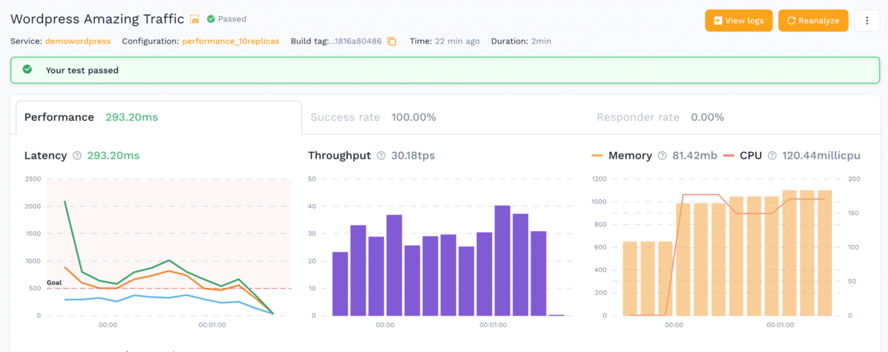

> Originally published on [speedscale.com](https://speedscale.com/blog/load-test-wordpress-nginx-on-kubernetes/).


Why this combination you ask? Load testing is my passion, and I am partial to Kubernetes. I challenged myself to share a use case that many could relate to, focused on a business critical application. Websites came to mind and WordPress is the world’s most popular website management system. Of course, nginx is the most popular web server so let’s throw that into the mix. And Kubernetes? With more than 50% of corporations adopting Kubernetes in 2021, what better system to run in. In this post you’ll see how to gain visibility into the performance of a WordPress site that uses nginx as the web server, with the whole thing running in Kubernetes.

In other words, how to go from this bogged down performance with throughput decline:



To this performance that will retain site visitors:


Let’s jump right in!

## Installing WordPress

For starters I’m assuming you already have a Kubernetes cluster and helm installed. For this example I’m using GKE, but there are plenty of other options for running a Kubernetes cluster in the cloud or even on your own desktop. Run this command to tell helm about the [bitnami charts](https://github.com/bitnami/charts), they have container images with defaults such as not running as a root user.

```
helm repo add bitnami https://charts.bitnami.com/bitnami
```

Now that helm is configured, run this command to install [bitnami WordPress](https://github.com/bitnami/charts/tree/master/bitnami/wordpress) (note I’ve turned off storage for nginx because this was not playing nice in GKE):

```
helm install --set persistence.enabled=false demowordpress bitnami/wordpress
```

You should see it start a couple of pods for nginx and mariadb as well as a load balancer service for accessing the site. If you’re using a cloud-based K8S distribution then a load balancer will be created, but if you’re using desktop Kubernetes then you need to sort out the local network yourself.


kubectl -n default get service demowordpress
NAME            TYPE           CLUSTER-IP    EXTERNAL-IP      PORT(S)                      AGE
demowordpress   LoadBalancer   10.24.10.24   AA.BBB.CCC.DDD   80:32199/TCP,443:31468/TCP   53s


Now if you open a browser to your load balancer EXTERNAL-IP is listening (ex: `http://AA.BB.CCC.DD`) then then you should see:


Since that site is just a little bit bland, you can also import some demo data to have a little more stuff to explore. If you want to log into your WordPress admin console the default username is `user` and the password can be found with:

```
kubectl get secret --namespace default demowordpress -o jsonpath="{.data.wordpress-password}" | base64 --decode
```

Install the [One Click Demo Import](https://wordpress.org/plugins/one-click-demo-import/) plugin and then import a WordPress [example XML](https://wpcom-themes.svn.automattic.com/demo/theme-unit-test-data.xml) with multiple blogs and pages. Now the WordPress instance has a little more content to make a more interesting scenario.

## Installing Speedscale

We are going to use `speedctl` to install the Speedscale components. If you don’t already have an account, you can sign up for a [Free Trial](https://app.speedscale.com/signup/). Use the install wizard to install the operator on your cluster and instrument the WordPress deployment.


speedctl install


The installer will give you special instructions for different distributions of Kubernetes:


✔ Connected to Kubernetes cluster.
Choose one:
 [1] Amazon Elastic Kubernetes Service
 [2] Google Kubernetes Engine
 [3] DigitalOcean
 [4] MicroK8s
 [5] Microsoft Azure Kubernetes Service
 [6] minikube
 [7] Self hosted
 [8] Other / I don't know
 [q] Quit
▸ Which flavor of Kubernetes are you running? [q]: 2


Since I’m running on GKE, it wants to know if this is an autopilot cluster because there are some additional steps. My cluster is on GKE Standard, so I’m ready to continue. Follow the rest of the prompts to install the operator:


✔ Speedscale Operator Installed.


Now that the operator is installed, you can use the installer to put the sidecar on specific workloads in the cluster. The WordPress deployment is running in the default namespace.


Choose one:
 [1] default
 [2] kube-node-lease
 [3] kube-public
 [4] kube-system
 [5] speedscale
 [q] Quit
▸ Which namespace is your service running in? [q]: 1


After following the standard prompts you will have the sidecar installed.


✔ Deployments patched.
  ℹ Patched default/demowordpress
▸ Would you like to verify your traffic and check for processing errors? [Y/n]: Y

## Exercising WordPress

All you have to do is go to your browser and click around on the site. Since you imported an existing site there should be several blogs and pages to explore. Every time you’re clicking around on the site, the Speedscale sidecar is transparently collecting details about each call. Next you can drill into the data to understand what is happening.

## Viewing WordPress Traffic

Now when you log into Speedscale, you can find my `demowordpress` service is receiving traffic. By clicking on this you can see a list of clusters where this is running (right now just the single cluster for testing).


When you click on your instance, you’ll see a summary in the traffic viewer. In here you can configure filters to narrow down your traffic. For example I’m going to focus in just on the HTTP traffic and ignore everything else.


There is also a list of every single call, you can click around and see the url, status code, full headers and payloads of requests and responses as well. This data will become the building block for the load test:


After looking at the traffic to make sure it’s what you want to use, click the `Generate Traffic Snapshot` button and give this snapshot a memorable name:


It can take a few seconds for your snapshot to be created, it’s analyzing all of the traffic patterns, data required, and preparing the traffic to be replayed.

## Running the Traffic Replay for Load

All that’s required to run this traffic as a load test is to create a patch file with a reference to this snapshot as well as a load test configuration. It looks something like this, put in the correct value for `SNAPSHOT_ID` and save this file as `patch.yaml`.


apiVersion: apps/v1
kind: Deployment
metadata:
  name: demowordpress
  annotations:
    test.speedscale.com/scenarioid: SNAPSHOT_ID
    test.speedscale.com/testconfigid: performance_10replicas
    test.speedscale.com/cleanup: "true"
        sidecar.speedscale.com/inject: "true"


Now you tell Kubernetes to add the patch to your deployment, and wait for the load to kick in:

```bash
kubectl patch deployment demowordpress --patch-file patch.yaml
```

Your deployment will get redeployed, and you should see Speedscale pods for the collector and generator will get created. The collector deployment will gather logs from your WordPress app and the generator is responsible for creating the transactions. At the end of the traffic replay, these deployments will get cleaned up automatically.

## Viewing Results

After the replay has completed new report is created with a summary of the results. It looks pretty good, but the WordPress site seemed to get a little bogged down and slower towards the end. This is evident by the response time continuing to rise while the throughput steadily drops, and the CPU starts to hit 2000 milli cpu. This is an indication of a potential scale-out problem.


At this point you can try to change the number of replicas of WordPress so there are more nginx instances to handle the traffic. Thanks to Kubernetes it will automatically scale out to all your replicas, no need to create additional infrastructure. You can put this modification into the patch file itself, and the deployment will scale out to 2 instances before the traffic replay test starts.


apiVersion: apps/v1
kind: Deployment
metadata:
  name: demowordpress
  annotations:
    test.speedscale.com/scenarioid: SNAPSHOT_ID
    test.speedscale.com/testconfigid: performance_10replicas
    test.speedscale.com/cleanup: "true"
    sidecar.speedscale.com/inject: "true"
spec:
  replicas: 2


After running the exact same load with double the number of replicas, the test report looks much better. The latency is no longer spiking, and the throughput stays consistent during the entire run, while the CPU is cut in half.


In addition, all the traffic is completed in just 2 minutes instead of taking over 3 minutes like the previous run.

## Summary

This example shows how easy it is to use existing traffic to create a load and scale out scenario for a WordPress app running in Kubernetes. If you are interested in running traffic against your applications, feel free to sign up for a [Free Trial](https://app.speedscale.com/signup/) of Speedscale today.