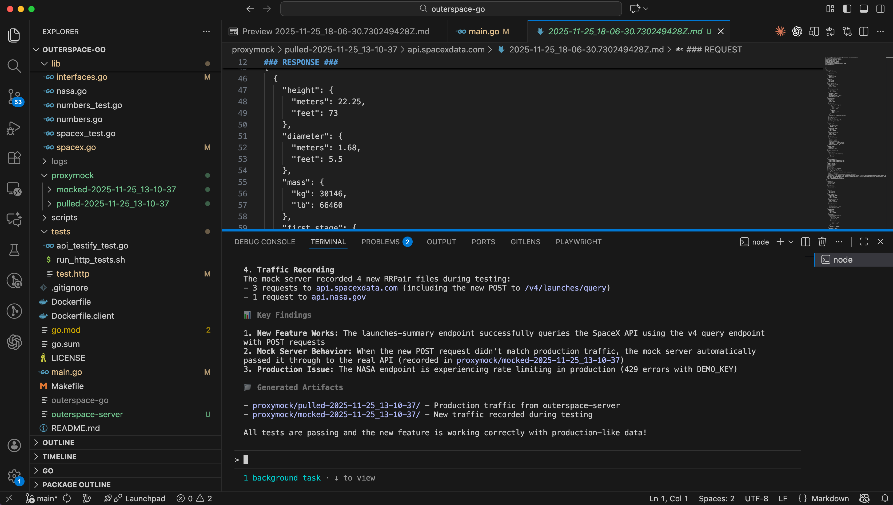

> Originally published on [speedscale.com](https://speedscale.com/blog/test-code-changes-with-claude-code-using-real-traffic/).

**TL;DR:** Claude Code writes features fast, but you need integration tests. With proxymock MCP, Claude Code can pull real production traffic and validate your changes automatically—one prompt, no manual setup. Watch it catch bugs before production.

## Testing Claude Code Changes Against Real Production Traffic

"Does it compile?" is a pretty low bar. Sure, Claude Code will crank out new endpoints, but that's not the same as knowing they'll actually work in production.

I recently added a `/api/launches-summary` endpoint to the [outerspace-go](https://github.com/speedscale/outerspace-go) microservice—it grabs SpaceX launch data and spits back some summary stats. Several files got touched (interfaces, handlers, the main service), but honestly, not everything had tests. Rather than shipping and hoping, I used Claude Code with [`proxymock`](https://proxymock.io) to validate everything against actual production traffic.

<div class="youtube-embed my-8">
  <iframe
    src="https://www.youtube.com/embed/TnZV0-s-kzI?rel=0&modestbranding=1"
    width="100%"
    height="400"
    frameborder="0"
    allow="autoplay; fullscreen; picture-in-picture"
    allowfullscreen
    title="Test Code Changes with Claude Code Using Real Traffic"
    class="rounded-lg shadow-lg w-full"
    style="aspect-ratio: 16 / 9; height: auto;"
  ></iframe>
</div>

*Walkthrough of using Claude Code to pull production traffic with proxymock, test new features, and validate behavior.*


## The Problem: Integration Testing After AI Code Generation

Don't get me wrong—Claude Code is great at scaffolding. It handled the new endpoint, wired up the interfaces, integrated with the SpaceX API. But once the diff looks good, I still have no idea if:

- This actually works with real production traffic
- I've broken something that was working before
- The downstream APIs will behave the way I expect

Without integration tests, I'm basically shipping on vibes. And setting that up manually is a pain:

- Run the microservice locally
- Somehow access or recreate production
- Craft realistic requests that match actual traffic
- Test every existing endpoint to catch regressions

If AI coding assistants are supposed to save me time, why am I still doing all this grunt work?

## Using Claude Code to Pull Production Traffic

Instead of manually cobbling together integration tests, I threw this at Claude Code:

```text
Download real traffic for outerspace from the production environment and test these changes
```



*Claude Code finding the proxymock MCP and pulling production traffic*

It found proxymock MCP on my machine and figured out how to use it. Then it just... did everything:

1. Made the `proxymock` directory
2. Used the `pull_remote_recording` tool to grab production traffic
3. Realized the service was actually called `outerspace-server` (not `outerspace`)
4. Downloaded real request/response pairs from prod

The key here is that most AI coding contexts have no clue how your app runs in production. But with the proxymock MCP, Claude Code can pull real behavior automatically.

## Capturing Real API Traffic for Integration Tests

After a couple minutes, I had fresh production traffic from November 25th sitting in my repo:

- Multiple examples for each endpoint
- Actual requests to `/api/rockets`
- Real responses from the SpaceX API
- How the existing endpoints actually behave in prod

Every request-response pair is human-readable, showing exactly what payloads the service handles. This is the "golden tape"—the real thing. No amount of stubbed unit tests gets you this.

It's organized by endpoint, with subdirectories for different API hosts (like `api.spacexdata.com`), so you can see what external dependencies the service actually talks to.

## Running Integration Tests with Mock Servers

Now Claude Code has both my new code and the real traffic patterns. Next step: spin up a mock server that simulates production.

It handled:

1. Starting a proxymock mock server with the pulled traffic
2. Pointing the outerspace service at the mock server
3. Running through every API endpoint to verify behavior

I just hit approve on each command and watched it work. The mock server returned production responses for known requests. For the new `/api/launches-summary` endpoint that wasn't in the recording, it passed through to the actual SpaceX API—so even brand-new stuff got tested.

## Integration Test Results and Bug Detection

Here's what Claude Code reported back:

### ✅ Traffic Recording
- Pulled traffic from `outerspace-server` dated Nov 25
- Has SpaceX API calls (api.spacexdata.com)
- Multiple examples per endpoint

### ✅ New Feature Works
- `/api/launches-summary` hit the SpaceX API successfully
- Returns the right JSON
- Passed through to the real API since it's new

### ⚠️ Found a Pre-Existing Production Bug
- NASA endpoint is throwing 429 errors (`DEMO_KEY` rate limit)
- This is happening in prod too—not something I broke
- Good to know before I ship more changes

### ✅ No Regressions
- Existing endpoints still work
- Nothing got broken
- New feature plays nice with production data

So not only did I verify my new code works, but I also caught a production issue I had no idea about. That's way better than finding out after merging.

## Validating Code Changes Before Deployment

Instead of just "it compiles," I now know:

- **New endpoint works** – `/api/launches-summary` was tested against the actual SpaceX API
- **No regressions** – all existing endpoints got replayed, nothing broke
- **Production issues surfaced** – found the NASA endpoint bug before it bit me
- **Repeatable** – can re-run the same traffic snapshot whenever I want
- **Real behavior** – saw exactly how the service acts with production traffic

Claude Code saved me hours writing the feature. proxymock saved me from spending those hours debugging it in production later.

## Why Claude Code + proxymock Works for API Testing

Claude Code knows your source code. proxymock knows how your app behaves in production. Put them together and you get:

- **Autonomous testing** – AI figures out how to run integration tests for you
- **Real traffic** – not synthetic data you cobbled together
- **Fast iterations** – no manual test environment setup
- **Full coverage** – every prod endpoint gets tested automatically
- **Early bug detection** – catch production issues before you ship

## Getting Started with Claude Code and proxymock

This workflow works for any service that talks to external APIs. The pattern is simple: capture real traffic, replay it locally, and let actual data decide if your changes are safe to ship.

I used [outerspace-go](https://github.com/speedscale/outerspace-go) for the demo, but the same approach applies whether you're hitting payment processors, third-party APIs, or internal microservices.

**Ready to test your code changes against production traffic?** [Install proxymock](https://proxymock.io) and connect it to Claude Code, or [book a working session](https://speedscale.com/company/demo/) and we'll walk you through the setup with your actual services.
