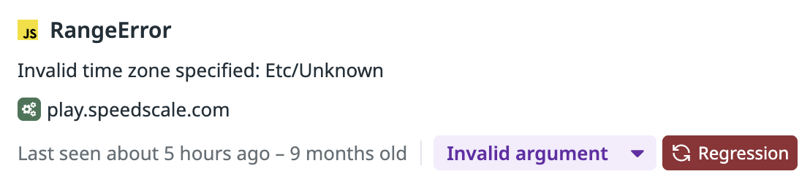
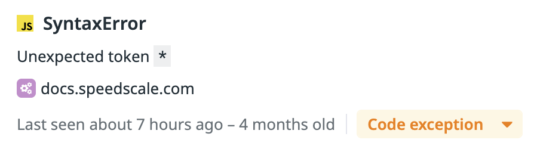
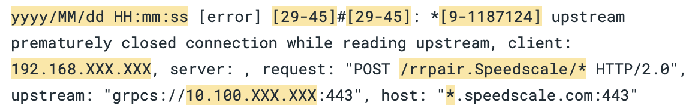

> Originally published on [speedscale.com](https://speedscale.com/blog/what-ai-has-never-seen-the-context-gap-in-code-generation/).


Your AI coding assistant has read the entire internet. It knows every programming language, every framework, every best practice documented in Stack Overflow answers and GitHub repositories. It can generate a REST API handler in seconds that looks perfect with clean code, proper error handling, following all the patterns.

But here's what it's never seen: your production traffic. Data from a real API request. Someone filling out a form with messed up or incomplete data.

[AI is changing how we write and test code](/blog/ai-code-how-ai-is-changing-how-we-write-and-test-it/), but there's a fundamental gap between training data and production reality.

And that's the gap where things break.

## The Invisible Production Reality


AI models are trained on documentation, code repositories, and curated examples. They learn from happy path. Perfectly clean API specs, sanitized test data, and idealized request/response patterns. What they don't see are the messy, inconsistent, edge-case-riddled requests that real users and systems actually send.

Let me show you what I mean.

### Emoji in the Wild

**AI's expectation:**

```json
{
  "username": "john_doe",
  "display_name": "John Doe"
}
```

**Production reality:**

```json
{
  "username": "🚀_rocket_dev_🌟",
  "display_name": "John 👨‍💻 Doe ✨"
}
```

Your AI generates a username validation function that checks for alphanumeric characters and underscores. It compiles. Tests pass. Code review approves it.

Then production users start reporting "Username invalid" errors—because half your users have emoji in their names. The AI had never seen this pattern because the OpenAPI spec said `string` and the examples showed simple ASCII.

### Timestamp Format Chaos

**AI's expectation:**

```json
{
  "created_at": "2026-02-04T10:30:00Z"
}
```

**Production reality (same API, different clients):**

```json
// Mobile app
{"created_at": "2026-02-04T10:30:00.123Z"}

// Legacy service
{"created_at": "2026-02-04T10:30:00+00:00"}

// Third-party integration
{"created_at": 1738666200}

// That one client nobody remembers
{"created_at": "2026-02-04 10:30:00 UTC"}
```

The AI writes a parser that handles ISO 8601. It's correct according to the spec. But it breaks on the Unix timestamp from the third-party integration and the legacy datetime string from your oldest service.



Production context would have shown all four formats in the first 100 requests.

### The Null vs. Empty String Problem

**AI's expectation (from docs):**

```json
{
  "email": "user@example.com",
  "phone": "+1-555-0100"
}
```

**Production reality:**

```json
// Client 1
{"email": "user@example.com", "phone": null}

// Client 2
{"email": "user@example.com", "phone": ""}

// Client 3
{"email": "user@example.com"}
// phone field missing entirely

// Client 4
{"email": "user@example.com", "phone": "N/A"}
```

The AI generates code that checks `if (phone)` and assumes it's a valid phone number. But `"N/A"` passes that check. Silent failure: an auto-dialer tries to call "N/A" and breaks.



### Floating Point Precision Drift

**AI's expectation:**

```json
{
  "total": 19.99,
  "tax": 1.6,
  "grand_total": 21.59
}
```

**Production reality:**

```json
{
  "total": 19.99,
  "tax": 1.5999999999999999,
  "grand_total": 21.589999999999996
}
```

Your AI writes a validation check: `if (total + tax === grand_total)`. Perfectly logical. Fails in production because JavaScript floating point math doesn't match the idealized examples.

The AI has never seen the actual precision drift from your payment processor's calculations.

### Flaky Backend Connections

**AI's expectation (from docs):**

```javascript
const response = await fetch("https://api.example.com/data");
const data = await response.json();
return data;
```

**Production reality:**

```text
[error] upstream prematurely closed connection while reading upstream
client: 192.168.XXX.XXX
server: api.example.com:443
upstream: grpcs://10.100.XXX.XXX:443
```

The AI writes clean code that assumes the upstream service is always available. It's correct according to the docs. But it never handles flaky connections, intermittent timeouts, or services that randomly drop connections under load.



Your upstream API works 99.9% of the time. That 0.1% produces connection errors the AI never anticipated. No retry logic. No graceful degradation. Just crashed requests and confused users.

## Why This Happens

AI coding tools learn from documentation, examples, and public repositories. These sources show the happy path: perfectly formatted API specs, sanitized test data, and idealized request/response patterns. When OpenAPI documentation shows a `username` field as type `string`, the examples demonstrate "john_doe" and "alice_smith". When timestamp fields appear in documentation, they show clean ISO 8601 format. When error handling examples exist, they demonstrate graceful degradation with retry logic and proper logging.

This training data shapes what AI generates. It writes code that validates usernames with alphanumeric regex because that's what the examples showed. It parses timestamps assuming ISO 8601 because that's what the spec documented. It writes error handling that matches the tutorial patterns for the framework you're using.

But production is different. Real users put emoji in usernames because your sign-up form doesn't prevent it. Legacy services send timestamps in three different formats because they were built over five years by different teams. Third-party APIs claim 99.9% uptime but randomly drop connections under load. Your payment processor returns floating point precision drift that breaks exact equality checks.

AI has never seen these patterns because they're not in documentation. They're in production traffic: the actual HTTP requests hitting your API, the real database queries your application runs, the genuine responses from your dependencies. The training data shows theory. Production shows reality.

This gap between training data and production reality is where AI-generated code breaks.

## The Silent Failure Problem

The most dangerous part? These bugs often don't crash your application.

They pass your linters. Static analysis says: no syntax errors, type-safe, looks good. Your tests pass because they use the same clean examples the AI learned from. Code review approves it. CI/CD goes green. You deploy Friday afternoon.

Monday morning, support tickets start rolling in. You check the logs. No crashes. No exceptions. No stack traces. The code is running perfectly.

Except it's not. The timestamp parser is dropping legacy clients. The phone validator is sending "N/A" to your email service. The floating point check randomly fails 2% of transactions. The backend connection crashes with no retry logic.

You don't get error alerts because nothing technically errored. The functions ran exactly as written. They're just silently rejecting users, corrupting data, or dropping requests. No stack trace to debug. No exception to catch. Just users leaving and revenue disappearing.

[Recent research shows AI-generated code creates 1.7x more logic and correctness errors](https://www.coderabbit.ai/blog/state-of-ai-vs-human-code-generation-report) than human-written code. This is why: **the context gap between training data and production reality**. Learn more about [improving AI code reliability](/blog/a-developers-guide-to-improving-ai-code-reliability/).

## How Production Context Changes This


Here's what your AI coding tool actually sees when connected to production context:

```markdown
## REQUEST

POST https://api.example.com:443/v1/users HTTP/2.0
Content-Type: application/json
User-Agent: mobile-app/3.2.1

{"username": "🚀*rocket_dev*🌟", "email": "user@example.com", "created_at": "2026-02-04T10:30:00.123Z"}

## RESPONSE

HTTP/2.0 201 Created
Content-Type: application/json

{"id": "usr*abc123", "username": "🚀_rocket_dev*🌟", "status": "active"}

## METADATA

- Timestamp: 2026-02-04 10:30:00 UTC
- Duration: 47ms
- Cluster: production
- Pod: user-service-7d9f8b4c-x2k9p
```

When AI agents query this captured traffic, they see patterns documentation never mentions:

**Real username patterns from last 100 requests:**

- 47% contain emoji (🚀 ✨ 💻 👨‍💻)
- 23% contain international characters (café, 北京)
- 15% contain spaces (against spec, but clients send them anyway)

**Actual timestamp formats in production:**

- ISO 8601 with milliseconds: 68%
- Unix timestamps: 8%
- Legacy datetime strings: 4%

**Phone field reality:**

- Valid E.164 format: 62%
- null, empty string, or missing: 35%
- "N/A" and other invalid: 3%

Now when you ask the AI to "add validation for username field," it generates code that handles emoji and international characters because it's seen your actual production data. The code works for your users, not just for documentation examples.

## Bridging the Gap

There are two ways to solve this:

### 1. Hope the AI Gets It Right (Current State)

- Generate code from docs and examples
- Test against idealized scenarios
- Ship and discover edge cases in production
- Incident → fix → repeat

### 2. Give AI Production Context (Close the Observability Gap)

- Capture real production traffic
- Give AI agents access via [Model Context Protocol (MCP)](/blog/4-tips-for-developing-model-context-protocol-server/)
- Generate code aware of actual patterns
- Replay traffic against code changes before shipping
- Catch silent failures that static analysis misses

The second approach is [runtime validation](/features/ai-code-verification/): testing behavior against production reality, not just synthetic test cases.

## What This Looks Like in Practice

With runtime validation using tools like [Speedscale's Proxymock](/proxymock/) MCP server:

1. **Capture production context:**

   ```bash
   # Record real API traffic (inbound and outbound)
   proxymock record --app-port 8080 --out proxymock/recorded
   ```

2. **Give AI agents access:**

   ```json
   // MCP config for Claude Code / Cursor
   {
     "mcpServers": {
       "proxymock": {
         "type": "stdio",
         "command": "proxymock",
         "args": ["mcp"]
       }
     }
   }
   ```

3. **AI sees production reality:**

   > The username validation logic needs to be properly updated

   AI agent queries production traffic, sees emoji in 47% of requests, generates Unicode-aware validation that won't break existing users.

4. **Validate before shipping:**
   ```bash
   # Replay real traffic against code changes
   proxymock replay --in proxymock/recorded --test-against http://localhost:8080
   ```

If your new code breaks the emoji usernames, you find out **before** deployment—because you're testing against real production patterns, not idealized examples.

## The Complement to Static Analysis

Runtime validation doesn't replace static analysis—it complements it. They catch different categories of problems:

| **Static Analysis**                                                                    | **Runtime Validation**                                                                          |
| -------------------------------------------------------------------------------------- | ----------------------------------------------------------------------------------------------- |
| **Syntax errors** - Missing braces, incorrect function signatures, undefined variables | **Behavioral regressions** - Code compiles but breaks existing user flows                       |
| **Type mismatches** - Passing string where number expected, incorrect return types     | **Edge case failures** - Emoji usernames, null vs empty string, floating point precision        |
| **Security vulnerabilities** - SQL injection, XSS, hardcoded credentials               | **Contract violations** - API returns different format than documented, unexpected status codes |
| **Code smells** - Unused variables, overly complex functions, duplicate code           | **Silent failures** - Validation that rejects 47% of users with no error logs                   |

Static analysis tells you if your code is well-formed and follows security best practices. Runtime validation tells you if your code handles the messy reality of production data. You need both. AI-generated code that passes linters but fails on real traffic is still broken code.

## Start With Context

The next time you ask an AI to generate code, ask yourself: _Has it ever seen my production traffic?_

If the answer is no, you're generating code with a context gap. It might work perfectly for the documented happy path. But production is never just the happy path.

Close the Observability Gap. Test against production reality. Catch the emoji usernames, timestamp variations, and null-vs-empty-string chaos before they become incidents.

Because the gap between what AI knows and what production does? That's where your next outage is hiding.

---

**Want to see what your AI has been missing?** [Try Speedscale's runtime validation for free](https://speedscale.com/company/demo/) or [set up the Proxymock MCP server](https://docs.speedscale.com/proxymock/) to give your AI agents production context today.
