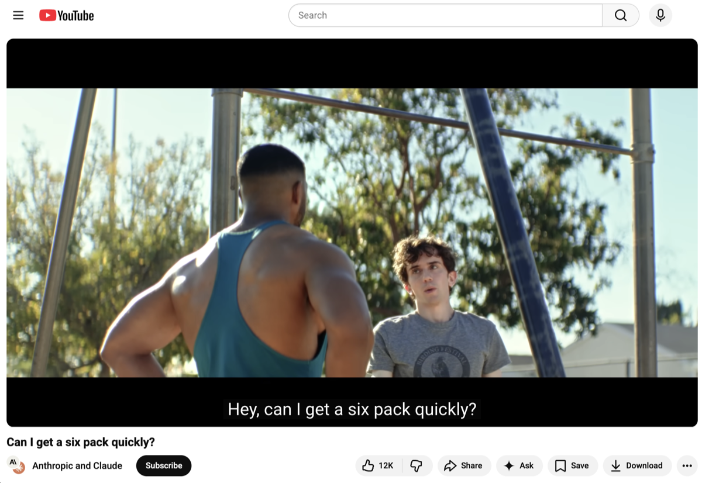
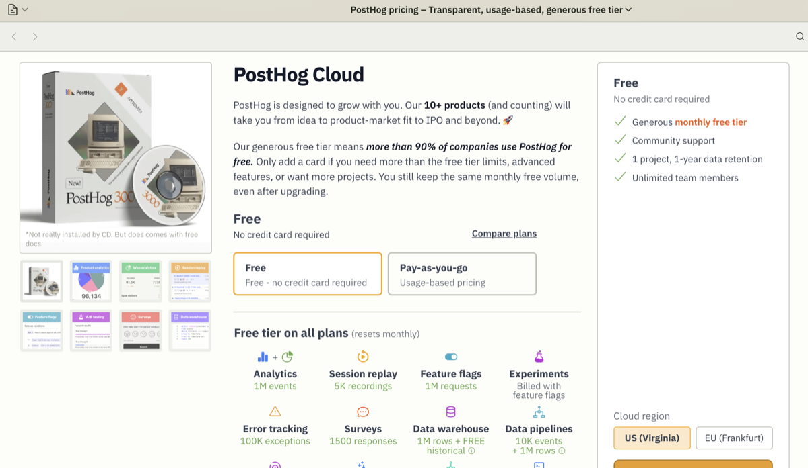
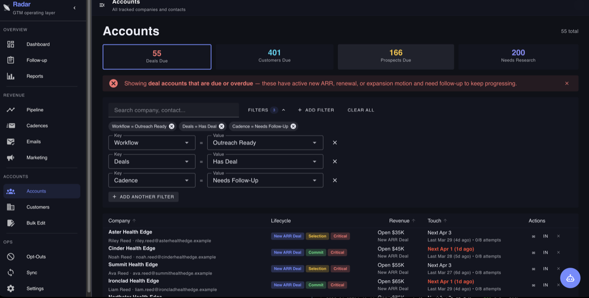

> Originally published on [speedscale.com](https://speedscale.com/blog/why-you-should-stop-buying-saas-and-start-building-it/).

Most founders have a build problem. Very few have solved the distribution problem. That gap is where startups die.

When someone comes to me with a startup idea (and this happens more than you'd think), I always ask the same question first:

**Have you thought about distribution?**

Not the product. Not the architecture. Not the funding round. Distribution: how are people going to find out this thing exists, decide they want it, and actually buy it?

The most common answer I get: "If I build something great, users will show up."

They won't.

## The Delusion of "Build It and They Will Come"

Let's use a company you might have heard of: Anthropic. They make Claude, arguably the most capable AI assistant in the world. And this year, they spent tens of millions of dollars on a Super Bowl ad.

Not because their product is bad. Because people don't show up out of thin air. Even Anthropic, with all its talent and capital, has to fight for attention.

The history of software is littered with technically superior products that lost to better-distributed ones. When MongoDB was getting started, there were hundreds of other NoSQL databases. Mongo won not just because the product was good. They won because they invested deeply in developer relationships, community, documentation, and advocacy. They made developers feel ownership over the product.

PostHog is another example worth studying. It's a Y Combinator company that built a generous free tier into their product from day one. You can use meaningful features without paying anything. When you hit the limit, you've already gotten value, so upgrading feels natural, not coercive. Value first, value upfront. That's a distribution strategy baked into the product itself.

In all three cases (Anthropic, MongoDB, PostHog), success required an intentional strategy for getting the product in front of the right people. None of them just waited.

## The Part Most Founders Skip: Early Prospecting

There's a solid framework from Y Combinator's Startup School (the videos are free on YouTube, no secret archive) about how to find your first customers.

  <iframe
    src="https://www.youtube.com/embed/gq_xOg6Mh6s?rel=0&modestbranding=1"
    width="100%"
    frameborder="0"
    allow="accelerometer; autoplay; clipboard-write; encrypted-media; gyroscope; picture-in-picture"
    allowfullscreen
    title="YC Startup School: How to Find Your First Customers"
    class="rounded-lg shadow-lg w-full"
    style="aspect-ratio: 16 / 9; height: auto;"
  ></iframe>

It starts with prospecting: identifying who your potential users are, reaching out, and figuring out if there's a fit. I'm building for people with problem X. If you have problem Y, that's fine — but you're not qualified right now.

This sounds obvious. Most founders still skip it, do it inconsistently, or only start thinking about it after a year of building.

Early-stage distribution is manual and hands-on. You can't outsource it. You can't automate your way past it. You need to talk to people.

## Why I Stopped Looking for a SaaS Tool and Just Built One

This thinking pushed me to build something. I called it Radar.

People who install our free product, sign up for a trial, meet us at a conference, or come in via introduction: they all arrive from a dozen different channels. I need to stay on top of all of them. Standard CRMs exist for this, but they're built for when someone is already interested in you. They're optimized for deal mechanics, not for early-stage interest cultivation.

I looked at what was available. Nothing fit. So I [vibe-coded](/blog/enterprise-vibe-coding) it: described what I wanted to an LLM, iterated fast, and had something working in a few sessions.

Here's the stack:

- **Server**: Express API plus scheduled sync jobs
- **UI**: Vue 3 app covering reports, accounts, pipeline, emails, SEO, alerts, bulk edit, sync status, opt-outs, and settings
- **Storage**: PostgreSQL-backed account and touch history with supporting sync tables
- **Automation**: Cron-driven syncs, webhook handling, draft generation, and playbook execution
- **Auth**: Auth0 for UI users and bearer-token access for scripts and agents

This would have taken weeks to build a few years ago. With LLMs doing the scaffolding, it took a few evenings.

## What Radar Actually Does

**Surfaces deals that have gone cold.** If weeks or months go by without contact, that's a signal. Either this isn't a priority for them, or I dropped the ball. Either way, I need to know. Not find out six months later when it's too late.

**Pulls in product usage data alongside contact history.** Not just "have we emailed them" but "are they actually using the product?" That changes the follow-up conversation entirely. An account that's been active every day gets a different email than one that signed up and went quiet.

**Drafts follow-up emails.** I feed in the account history, notes from past meetings, and context about their use case. The LLM drafts a starter. I don't have to send it verbatim — I edit it, make it mine. But it eliminates the blank-page problem. If the draft isn't right, I prompt it to adjust. The cognitive load drops.

**Holds me accountable to prospecting volume.** Am I having enough calls? Is the outbound volume actually there? Radar shows me the numbers so I can't lie to myself about how much work is getting done.

A lot of CRM tools are focused on *after* someone's interested. The mechanics of moving a deal through stages. That matters. But early on, you need to generate the interest in the first place. Radar is built for that phase.

## The Real Lesson Here

Radar isn't the point. The point is that the barrier to building custom internal tooling has collapsed.

Your specific combination of signals, data sources, and workflows doesn't fit neatly into anyone else's product. It never did. But previously, building something custom meant weeks of work or hiring an engineer to do it. Now it means a few focused sessions with an LLM and a willingness to iterate. We've done this ourselves, [building an autonomous dev agent](/blog/building-speedy-autonomous-ai-development-agent) that handles entire tickets end to end, and the barrier really has collapsed.

For startup founders specifically: the tools you need to stay disciplined about distribution probably don't exist in exactly the form you need them. You can either spend months evaluating SaaS products that almost fit, or you can spend a weekend building something that exactly fits.

The underlying advice hasn't changed: figure out your distribution problem first, and stay disciplined about it. But the tooling available to help you do that has changed.

Most early-stage startups fail not because the product was bad. They fail because nobody found out it existed.

Don't be that startup.

*Ken Ahrens is co-founder of Speedscale. Find him on [LinkedIn](https://www.linkedin.com/in/kahrens/).*
