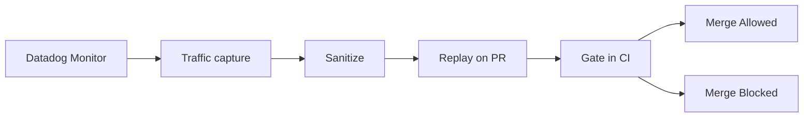
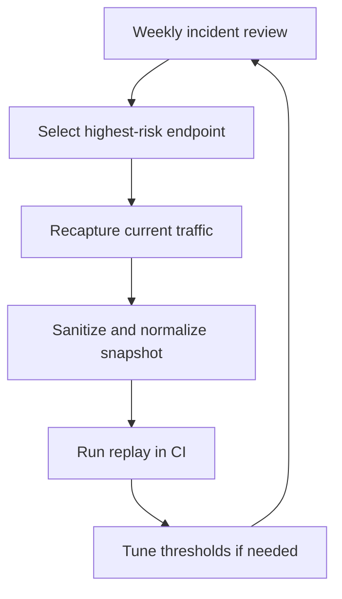

> Originally published on [speedscale.com](https://speedscale.com/blog/from-datadog-to-test-suite/).


I worked in observability for years, and the same pattern showed up across teams. An alert fired, the on-call rotation scrambled, and everyone did what they had to do to stabilize production.

Then came the retrospective. Once the immediate pressure was gone, the conversation shifted to one question: how do we make sure this never happens again? My friend [Jade Rubick](https://www.rubick.com/) coined a name for that principle: [DRI, "don't repeat the incident"](https://www.rubick.com/dont-repeat-incidents/).

Traffic capture and replay is how you actually enforce it. You pull a focused snippet of production traffic from the incident window, replay it against future changes, and wire it into CI so the same failure mode gets blocked before deploy.


_Datadog monitor screenshot source: [Datadog Monitors documentation](https://docs.datadoghq.com/monitors/draft/)_

This post shows how to operationalize DRI in practice so incident evidence turns into a permanent CI guardrail. If you read ["The Observability Gap"](/blog/the-observability-gap/), this is the practical implementation guide.



## The core idea

Stop asking, "What tests should we invent?" Start asking, "What did production already teach us?" Datadog already holds the raw material: latency baselines (p95 and p99), error-rate patterns, dependency behavior, and trace evidence from real incidents. The job is to translate those signals into pre-release assertions that run automatically on every pull request.

## A simple operating model

Use this five-step pipeline for one service at a time.

1. Pick one production risk from Datadog.
2. Capture representative traffic for that risk path.
3. Sanitize and normalize the capture for safe replay.
4. Replay in CI against the branch build.
5. Fail the pipeline when behavior drifts from known-good baselines.

That is it. You are not replacing your current test strategy. You are adding a production-realistic layer on top of unit and integration tests.

### Map each signal to a test artifact

Many teams stall because they see interesting dashboards but do not know how to turn them into executable checks. Use this mapping model to keep the workflow concrete.

| Datadog signal type        | What it tells you                       | Test artifact to create             | CI assertion                       |
| -------------------------- | --------------------------------------- | ----------------------------------- | ---------------------------------- |
| p99 latency regression     | Route got slower under real traffic     | Replay scenario for that route      | p99 <= agreed threshold            |
| Error-rate spike           | Failure mode is reproducible            | Snapshot with failing payload mix   | error rate <= baseline + tolerance |
| Upstream dependency change | Response shape or timing drifted        | Mock or replay dependency responses | contract and status stability      |
| Incident trace pattern     | Sequence of calls that triggered outage | End-to-end replay workflow          | no critical errors under replay    |

If a dashboard widget cannot be tied to one row in this table, it is not ready for CI gating yet.

## Step 1: Start with one specific Datadog signal

Choose a narrow target, not a broad initiative.

Good starting signals:

- A recurring endpoint with p99 latency spikes
- A dependency integration that caused incidents in the last 30 days
- A high-volume endpoint with intermittent 5xx responses

Pull a single time window where behavior was representative: normal traffic, not only outage chaos.

## Step 2: Capture traffic that matches that signal

Use a traffic capture tool (`proxymock` locally or Speedscale in Kubernetes) to collect real request and response shapes for the target path.

Focus on:

- Request diversity: headers, params, payload sizes
- Dependency responses: success cases, retries, slow responses
- Timing characteristics, not just status codes

If your current tests only use static fixtures, this is where realism jumps.

## Step 3: Sanitize, normalize, and version the snapshot

Raw traffic cannot go straight into CI. You need to clean and stabilize it first.

Minimum processing:

- Redact PII and secrets
- Rewrite expiring auth tokens
- Normalize timestamps and IDs where required
- Keep deterministic replay behavior

Treat snapshots like test assets. Put them under version control policy, ownership, and retention rules.

## Step 4: Replay in CI and gate with Datadog-informed thresholds

Now run replay tests on each PR and compare behavior to your baseline. Pass thresholds directly to `proxymock replay` with `--fail-if`:

```bash
proxymock replay \
  --test-against http://localhost:8080 \
  --fail-if "requests.failed > 0" \
  --fail-if "latency.p99 > 180"
```

The numbers above are examples. Use values from your own Datadog history.

### CI example (GitHub Actions)

Use your existing pipeline and add replay as a merge gate after unit and integration tests:

```yaml
name: replay-validation

on:
  pull_request:
    branches: [main]

jobs:
  replay-check:
    runs-on: ubuntu-latest
    steps:
      - uses: actions/checkout@v4

      - name: Build service
        run: docker compose up -d --build

      - name: Start mock from captured snapshot
        run: proxymock mock --in ./traffic/checkout

      - name: Replay and validate thresholds
        run: |
          proxymock replay \
            --in ./traffic/checkout \
            --test-against http://localhost:8080 \
            --fail-if "requests.failed > 0" \
            --fail-if "latency.p99 > 180"
```

This pattern works the same way in GitLab CI or Jenkins. The key is not the CI vendor. The key is enforcing a pass/fail contract on production-shaped traffic before merge.

## Step 5: Keep snapshots fresh with a weekly refresh loop

Production evolves. Your replay data must evolve with it.

Run a weekly maintenance loop:

- Refresh one high-value snapshot
- Retire stale scenarios
- Add one new edge case from recent incident analysis
- Review failing assertions for false positives versus real drift

This keeps replay tests trustworthy instead of brittle.



## What this looks like in practice

Here is a realistic rollout path that works for most platform teams:

- Week 1: One endpoint, one snapshot, one CI replay gate
- Week 2: Add one dependency-heavy workflow
- Week 3-4: Add latency thresholds from Datadog p99 history
- Month 2: Expand to top 5 incident-prone paths

The mistake to avoid is trying to convert your whole stack in one sprint.

## Common failure modes (and fixes)

### Garbage in, garbage out

If your input data is synthetic, your assertions are still guesswork. Replay production-shaped traffic before trusting pass/fail results.

### Capturing everything, operationalizing nothing

Teams get excited, dump six months of traffic into a directory, and never finish wiring it up. Start from one SLO-linked risk path and expand only after it gates deploys reliably.

### No owner, no freshness

Replay pipelines rot without explicit owners. Assign ownership to the same team that owns service SLOs and incident review — otherwise nobody notices when snapshots go stale.

## How to pick safe, realistic thresholds

Threshold debates can derail adoption. Keep it mechanical.

Start with the last 14 to 30 days of stable production behavior, then define an explicit tolerance band. For example, if p99 sits around 142ms, you can gate at 160ms to absorb normal variance while still catching real regressions. Do the same for error rate and dependency-specific failures.

Avoid these anti-patterns:

- using a single best-case day as your baseline
- setting thresholds so tight they fail on noise
- setting thresholds so loose they never block regressions

If you are unsure, start with warning-only mode for one week, collect false positives, then switch to hard merge blocking.

## Where this fits in your testing stack

Replay validation is not a replacement for unit tests, contract tests, or load tests. It is the production-context layer that catches issues those layers miss.

- Unit tests answer: does this function behave correctly?
- Contract tests answer: does this interface remain compatible?
- Replay validation answers: does this change survive real production-shaped behavior?

Teams that combine all three get better release velocity because they spend less time triaging avoidable post-deploy regressions.

## Why this matters for both speed and safety

When you move Datadog signals into tests, you reduce two expensive outcomes at once:

- preventable regressions that escape to production
- slow release cycles caused by low confidence

You ship faster because confidence comes from production-informed validation, not optimism.

## Getting started this week

If you want a practical first win, do this:

1. Pick one endpoint that triggered a Datadog alert last month.
2. Capture and sanitize a traffic snapshot for that endpoint.
3. Add replay validation to CI with one latency and one error-rate assertion.
4. Block merge on regression.

Then repeat for the next highest-risk path.

If you want to run this locally first, start with [`proxymock`](/proxymock/) and the [installation guide](https://docs.speedscale.com/proxymock/getting-started/installation/). If you need Kubernetes-scale capture and replay pipelines, see [Speedscale API Observability](/features/api-observability/) and [AI Code Verification](/features/ai-code-verification/).

For a deeper walkthrough of capture and replay design choices, read [The Definitive Guide to Traffic Replay](/blog/definitive-guide-to-traffic-replay/).

The goal is not more dashboards. The goal is fewer surprises.
